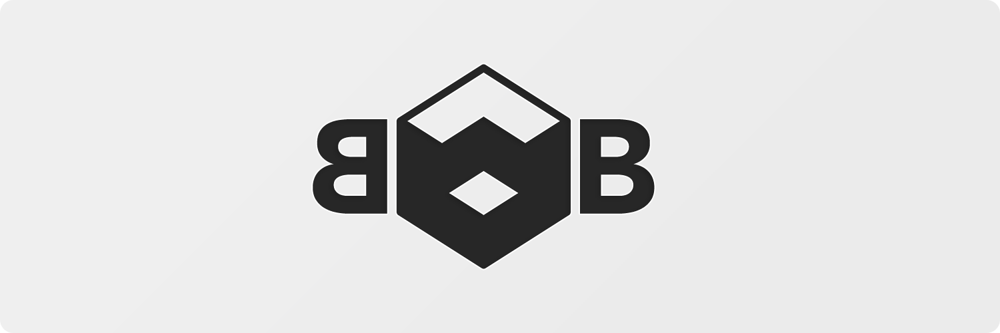

<h1 align=center>Black Box</h1>
<p align=center>An exerimental 🧨 Voxel Engine based on <a href="https://www.vulkan.org/">Vulkan 🌋</a> written in <a href="https://www.rust-lang.org/">Rust 🦀</a></p>

<p align=center>


</p>


<br />

## Usage

### How to Run Examples

All examples are located under the [examples](examples) directory.

These examples use the default syntax for running examples, as found in the [Cargo](https://doc.rust-lang.org/cargo/reference/manifest.html#examples) documentation. For example, to run the `simple-window` example:

```bash
▲ ~ cargo run --example simple-window
```